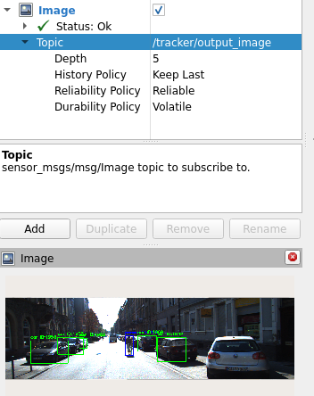

# Real-Time MOT on KITTI with YOLOv8, BYTETrack, Cyclist Filter, Evaluation and ROS2

This project implements a **tracking-by-detection** pipeline for autonomous driving scenarios using YOLOv8 for real-time object detection, BYTETrack for identity-preserving tracking, MOTMetrics for quantitative evaluation, and ROS2 for deployment.

---

## Dataset
- **[KITTI Tracking Dataset](http://www.cvlibs.net/datasets/kitti/eval_tracking.php)**
- Real-world driving scenes captured from a moving vehicle
- Annotated bounding boxes for object categories like `Car`, `Pedestrian`, and `Cyclist`
- Used **sequence 0000** for this project
  
----

## Challenges & Solutions

### Challenge 1: Class mismatch
- YOLOv8 (COCO) has `person`, `car`, `bicycle`
- KITTI expects `Car`, `Pedestrian`, `Cyclist`

**Solution:** Implemented a **cyclist filter**, if IoU between `person` and `bicycle` is high → discard as `Cyclist`

### Challenge 2: BYTETrack ignores class labels
- BYTETrack only tracks bounding boxes

**Solution:** After tracking, reassign **class IDs** to each track by matching with original YOLO detections using IoU

---

## Pipeline Overview 

- **Input:** Left camera frames (`image_02/`) + KITTI labels (`label_02/`)
- **Steps:**
  - **Detection:** YOLOv8 for object detection
  - **Cyclist Filter:** Match `person` and `bicycle` using IoU
  - **Tracking:** BYTETrack with filtered detections
  - **Class ID assignment:** Match tracked boxes with original detection boxes
  - **Evaluation:** Compare against KITTI labels using `motmetrics`
  - **Deployment:** ROS2 publisher → subscriber → detection + tracking → publish result
- **Output:** MOT metrics + tracked frames visualized in **Rviz**

---

## Detection Confidence Tuning Results (YOLOv8 + BYTETrack)
I evaluated the effect of varying the confidence threshold (`conf`) from 0.5 to 0.8. Below are the key MOT metrics across settings. 

| Conf | MOTA      | IDF1      | IDP       | IDR   | FP     | FN     | IDs | GT MT/PT/ML           |
| ---- | --------- | --------- | --------- | ----- | ------ | ------ | --- | --------------------- |
| 0.3  | 41.9%     | 66.7%     | 59.2%     | 76.2% | 111    | 35     | 8   | 11 (9 MT, 1 PT, 1 ML) |
| 0.4  | 44.5%     | 67.3%     | 60.1%     | 76.6% | 106    | 33     | 8   | -                     |
| 0.5  | 46.8%     | 68.2%     | 61.5%     | 76.6% | 99     | 34     | 8   | -                     |
| 0.6  | **55.8%** | **71.6%** | 67.6%     | 76.2% | 72     | 38     | 7   | -                     |
| 0.7  | **55.8%** | 69.9%     | **78.4%** | 63.0% | **28** | **80** | 9   | 11 (3 MT, 7 PT, 1 ML) |

> **conf = 0.6** is the best overall point:
> 
> Highest IDF1
> 
> Best MOTA
> 
> Reasonable FP / FN balance
> 
> Strong MT count

---
## Observation

- **MOTA improves from 41.9% to 55.8%** as the threshold is raised
  - Fewer False Positives (FP): Model becomes more confident, reducing junk detections.
  - Recall suffers at conf=0.7: More False Negatives (FN) (missed detections).
 
- **IDF1 and IDP/IDR trend**
   - IDF1 peaks at 71.6% (conf=0.6)
   - IDP continues improving even at 0.7 (up to 78.4%) -> precision is best when it is the most strict
   - IDR drops at 0.7 -> lower recall
 
- **Tracking IDs**
  - ID switches (IDs) stay between 7 and 9, tracking is stable overall.
  - Mostly Tracked (MT) goes from 9 to 3 at conf=0.7 -> missing many tracklets.
  - At conf=0.6, 8 MT and just 1 ML -> best balance.

---

## Future Directions
No appearance cues were used, so tracking is purely IoU-based. There is still room to reduce identity switches and false positives, possibly by:

- Adding appearance-based re-ID (e.g. DeepSORT)
- Using depth-aware filtering to improve spatial consistency
- Filtering out very low-confidence boxes

## Rviz Output

## Demo Video

  

[Download full MP4 video](videos/kitti_tracking_output.mp4)

## Author

**Monisha**  
Connect via [Medium](https://medium.com/@monishatemp20)  

---
